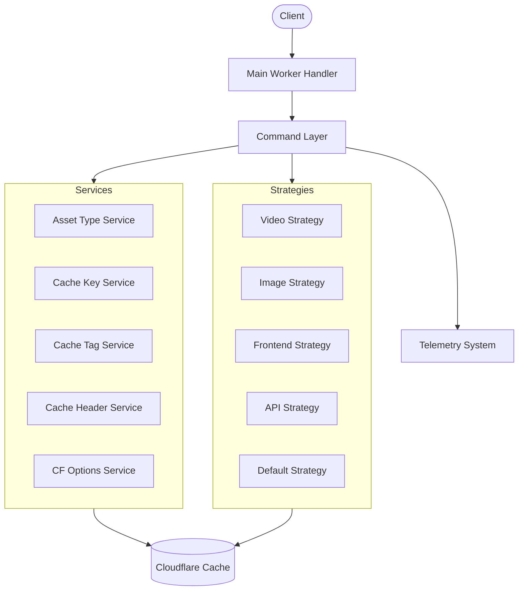
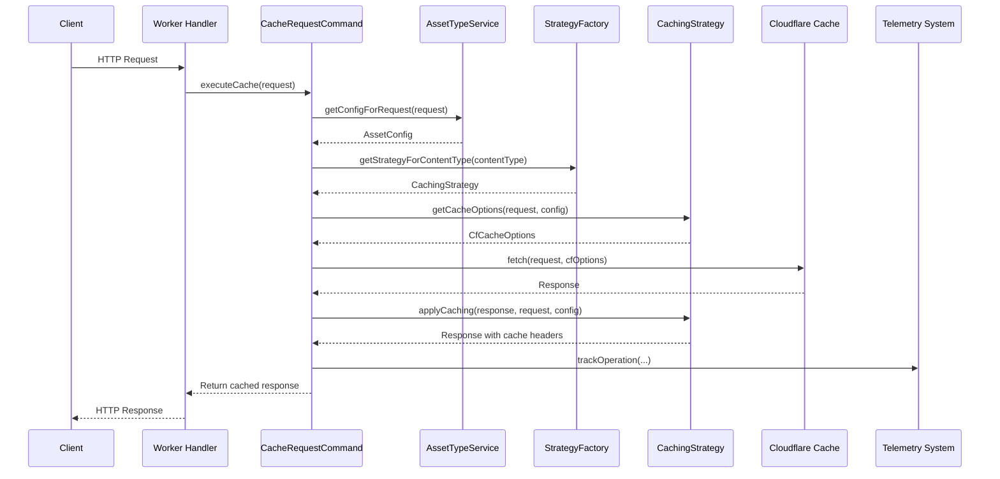
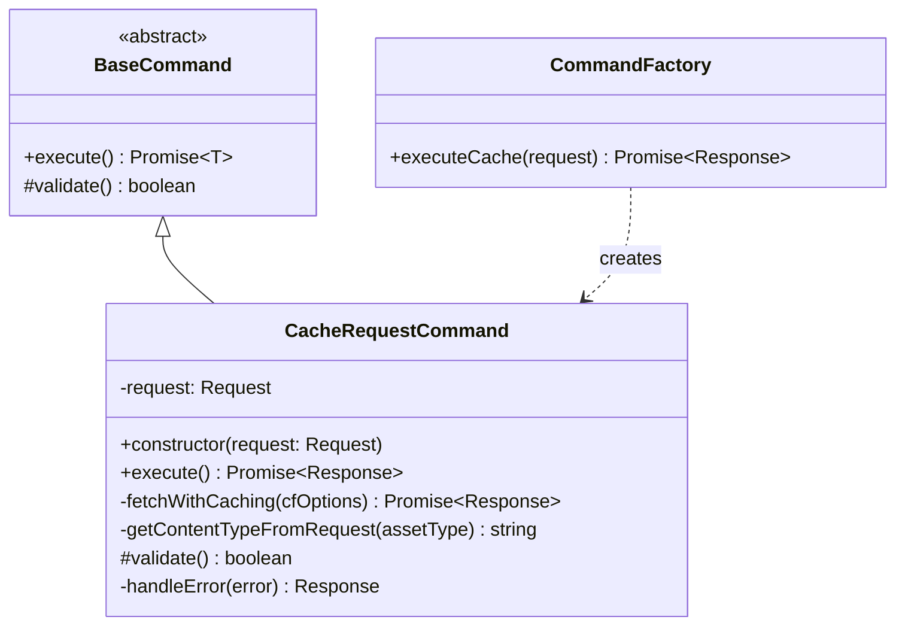
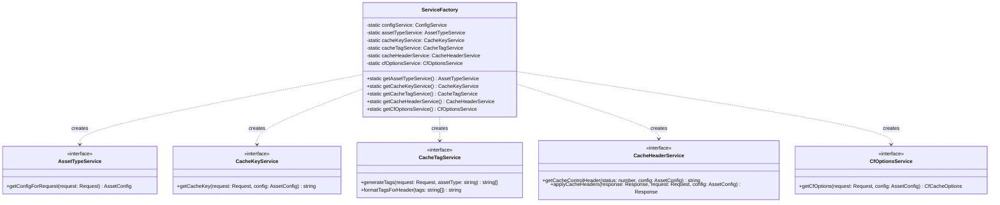
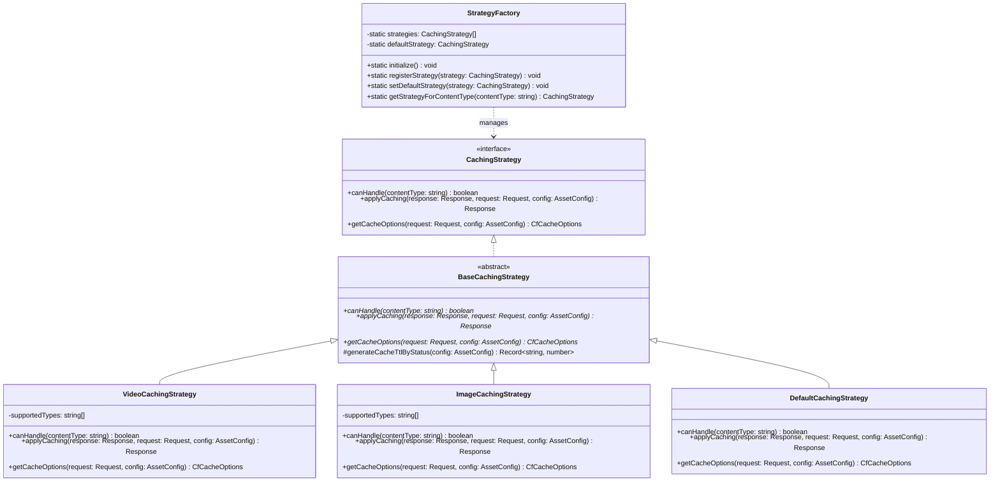
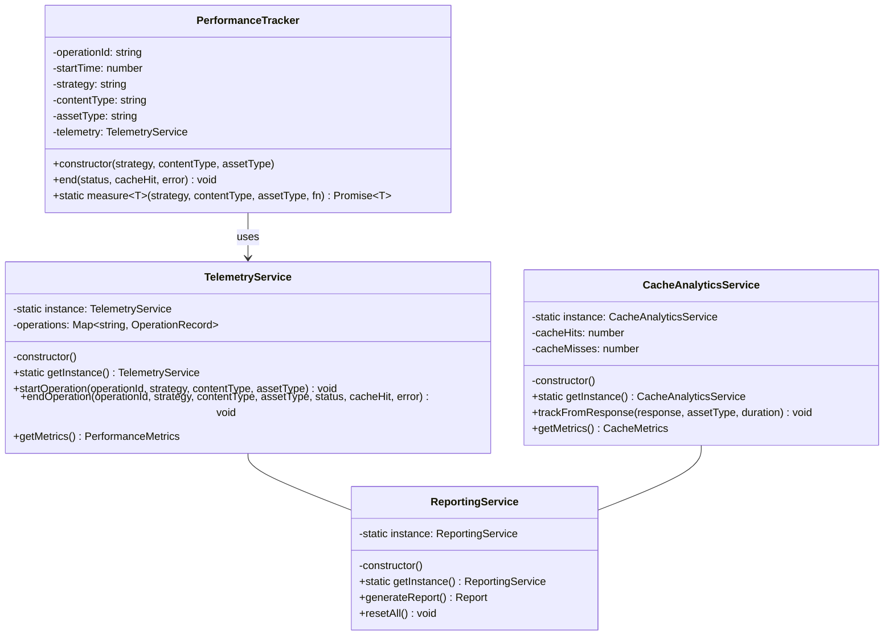
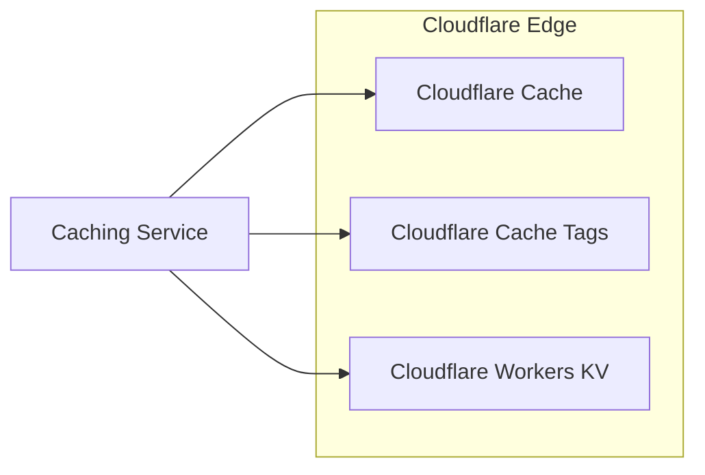
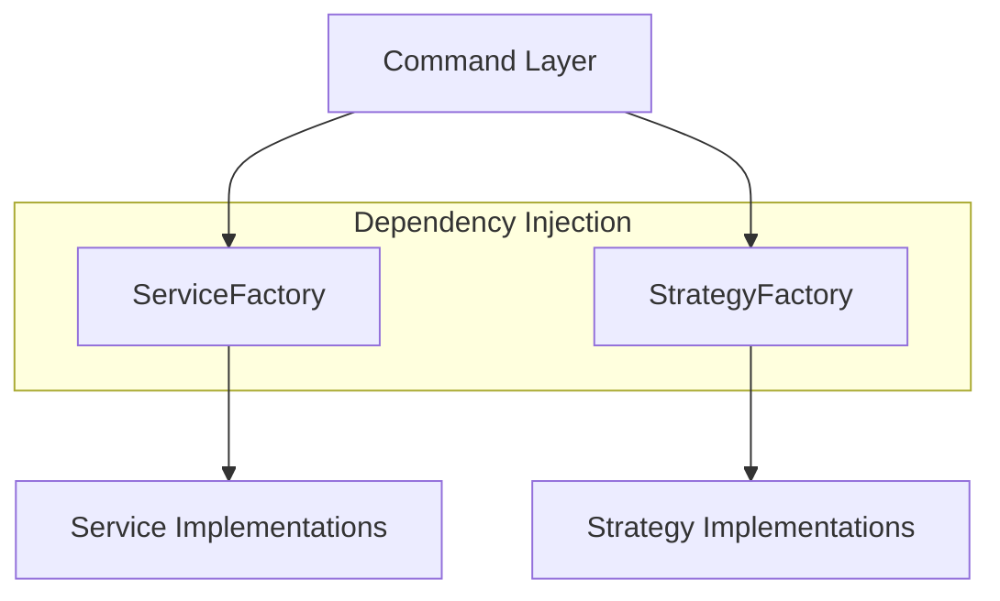
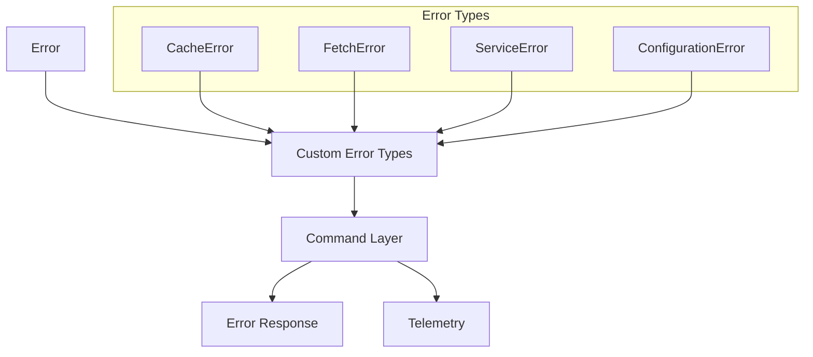
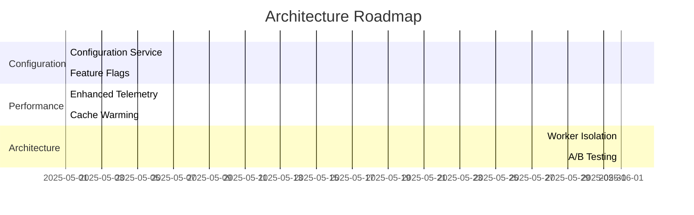

# Architecture Overview

This document provides a comprehensive overview of the Cloudflare Caching Service architecture.

## High-Level Architecture

The caching service follows a modern architecture with these patterns:

- **Service-Oriented Architecture**: Core functionality in specialized services
- **Dependency Injection**: Services provided through a factory pattern
- **Command Pattern**: Operations encapsulated as executable commands
- **Strategy Pattern**: Content-specific caching strategies
- **ES Modules**: Modern JavaScript module system

## System Overview



The core components of the system are:

1. **Main Worker Handler**: Entry point for all requests
2. **Command Layer**: Encapsulates operations as executable commands
3. **Service Layer**: Provides core functionality through specialized services
4. **Strategy Layer**: Implements content-specific caching behaviors
5. **Telemetry System**: Monitors and reports on system performance

## Request Flow



1. Request enters the worker
2. Asset type is determined based on URL pattern
3. Appropriate caching strategy is selected based on content type
4. Strategy generates Cloudflare-specific cache options
5. Request is fetched with these options
6. Response is processed by the strategy to apply appropriate headers
7. Telemetry data is captured
8. Response is returned to the client

## Component Architecture

### Command Layer

The command layer follows the Command pattern and is responsible for coordinating the execution of operations:



- `BaseCommand`: Abstract class defining the command interface
- `CacheRequestCommand`: Handles request caching operations
- `CommandFactory`: Creates and executes commands

### Service Layer

The service layer follows a service-oriented architecture and provides core functionality:



- `AssetTypeService`: Detects content type from URL patterns
- `CacheKeyService`: Generates cache keys with query parameter handling
- `CacheTagService`: Creates hierarchical cache tags for each request
- `CacheHeaderService`: Manages response headers for optimal caching
- `CfOptionsService`: Generates Cloudflare-specific caching options
- `ServiceFactory`: Creates and provides access to services

### Strategy Layer

The strategy layer implements the Strategy pattern for content-specific caching behaviors:



- `BaseCachingStrategy`: Abstract class defining the strategy interface
- Content-specific strategies for different asset types
- `StrategyFactory`: Selects the appropriate strategy for a content type

### Telemetry System

The telemetry system monitors and reports on system performance:



- `TelemetryService`: Tracks operations and performance
- `CacheAnalyticsService`: Tracks cache hit/miss rates
- `ReportingService`: Generates comprehensive reports
- `PerformanceTracker`: Utility for measuring operation durations

## Integration Points

The caching service integrates with the following Cloudflare systems:



1. **Cloudflare Cache**: Via cache options and headers
2. **Cloudflare Workers KV**: For persistent configuration (upcoming)
3. **Cloudflare Cache Tags**: For granular cache invalidation

## Code Organization

```
├── src/
│   ├── commands/          # Command pattern implementations
│   ├── errors/            # Custom error types
│   ├── services/          # Core service implementations
│   ├── strategies/        # Content-specific strategies
│   ├── telemetry/         # Performance monitoring
│   ├── tests/             # Test files
│   ├── types/             # TypeScript interfaces
│   ├── utils/             # Utility functions
│   └── cache.ts           # Main entry point
├── admin-ui/              # Admin interface
```

## Dependency Management

The system uses dependency injection through the ServiceFactory and StrategyFactory patterns, which provides:



1. Centralized service creation
2. Simplified testing through mock injection
3. Clear separation of concerns
4. Singleton management for services

## Error Handling

The error handling strategy follows these principles:



1. Custom error types for different error categories
2. Centralized error handling in the command layer
3. Detailed error metadata for debugging
4. Graceful degradation in error conditions
5. Telemetry tracking of errors for monitoring

## Future Architecture Improvements



1. **Configuration Service**: Centralized configuration management
2. **Feature Flags**: Dynamic feature enablement
3. **Enhanced Telemetry**: More detailed performance monitoring
4. **Worker Isolation**: Breaking functionality into separate workers
5. **Cache Warming**: Proactive cache population
6. **A/B Testing**: Testing different caching strategies