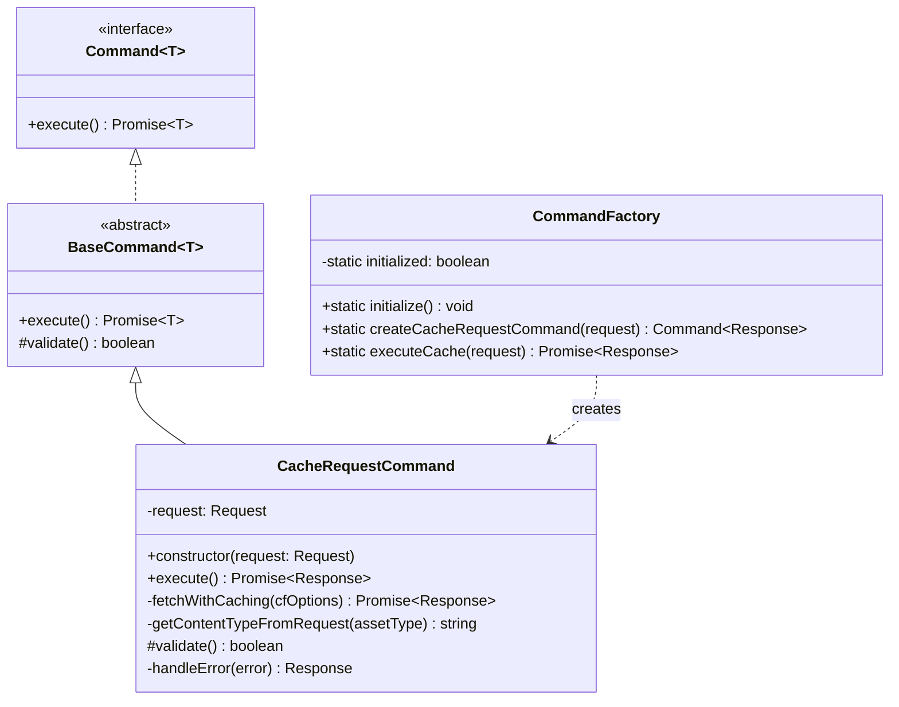
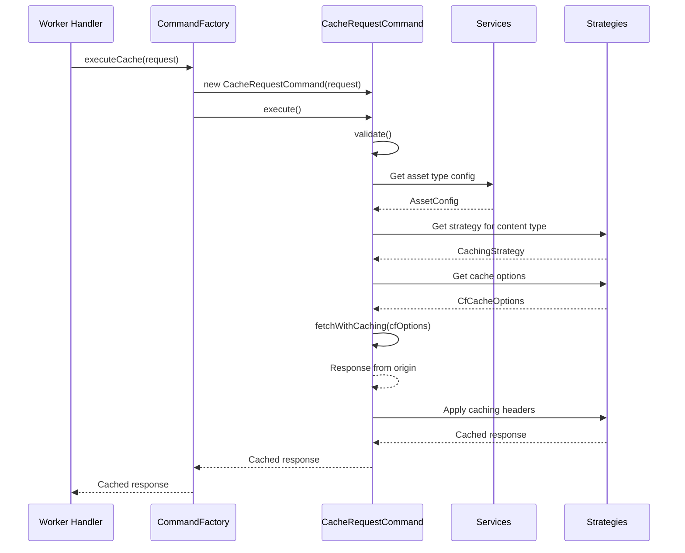

# Command System

This document provides details on the command pattern implementation in the caching service.

## Overview

The Command pattern encapsulates operations as objects, allowing for better separation of concerns, undo/redo functionality, and more structured error handling.





## Command Architecture

- `command.ts` - Base command interface and abstract class
- `command-factory.ts` - Factory for creating and executing commands
- Specialized command implementations for specific operations

## Available Commands

| Command | File | Description |
|---------|------|-------------|
| Base Command | `command.ts` | Abstract base class for all commands |
| Cache Request Command | `cache-request-command.ts` | Handles request caching |

## Command Pattern Implementation

Each command follows this pattern:

```typescript
// Define a command
class SomeCommand extends BaseCommand<ResultType> {
  constructor(private params: any) {
    super();
  }
  
  async execute(): Promise<ResultType> {
    // Command implementation
    // Use services, apply business logic
    return result;
  }
}

// Use the command
const command = new SomeCommand(params);
const result = await command.execute();
```

## Command Lifecycle

1. **Creation**: Command is instantiated with necessary parameters
2. **Execution**: `execute()` method is called
3. **Validation**: Parameters are validated (optional)
4. **Processing**: Business logic is applied
5. **Completion**: Result is returned

## CacheRequestCommand

The main command in the caching service is the `CacheRequestCommand`, which handles the caching of requests:

```typescript
export class CacheRequestCommand extends BaseCommand<Response> {
  private request: Request;
  
  constructor(request: Request) {
    super();
    this.request = request;
  }
  
  async execute(): Promise<Response> {
    // 1. Validate input
    this.validate();
    
    // 2. Get configuration for this request
    const config = assetTypeService.getConfigForRequest(this.request);
    
    // 3. Select appropriate caching strategy
    const contentType = this.getContentTypeFromRequest(config.assetType);
    const strategy = StrategyFactory.getStrategyForContentType(contentType);
    
    // 4. Get Cloudflare-specific options
    const cfOptions = strategy.getCacheOptions(this.request, config);
    
    // 5. Fetch with cache configuration
    const originalResponse = await this.fetchWithCaching(cfOptions);
    
    // 6. Apply cache headers
    const response = strategy.applyCaching(originalResponse, this.request, config);
    
    return response;
  }
}
```

## Error Handling

The command pattern centralizes error handling:

```typescript
async execute(): Promise<Response> {
  try {
    // Command implementation
    return response;
  } catch (error) {
    return this.handleError(error);
  }
}

private handleError(error: unknown): Response {
  // Log error and create an appropriate error response
  if (error instanceof CacheError) {
    logger.error(`${error.name}: ${error.message}`, { 
      url: this.request.url,
      ...error.metadata
    });
  } else {
    logger.error('Unexpected error processing request', { 
      url: this.request.url, 
      error: error instanceof Error ? error.message : String(error)
    });
  }
  
  return createErrorResponse(error, this.request);
}
```

## Command Factory

The `CommandFactory` creates and executes commands:

```typescript
export class CommandFactory {
  static initialize(): void {
    // Initialize services and strategies
  }
  
  static createCacheRequestCommand(request: Request): Command<Response> {
    // Ensure initialization
    if (!this.initialized) {
      this.initialize();
    }
    
    return new CacheRequestCommand(request);
  }
  
  static async executeCache(request: Request): Promise<Response> {
    // Ensure initialization
    if (!this.initialized) {
      this.initialize();
    }
    
    const command = this.createCacheRequestCommand(request);
    return command.execute();
  }
}
```

## Integration with Services

Commands use services through the `ServiceFactory`:

```typescript
const assetTypeService = ServiceFactory.getAssetTypeService();
const config = assetTypeService.getConfigForRequest(this.request);
```

## Integration with Strategies

Commands use strategies through the `StrategyFactory`:

```typescript
const strategy = StrategyFactory.getStrategyForContentType(contentType);
const cfOptions = strategy.getCacheOptions(this.request, config);
```

## Integration with Telemetry

Commands integrate with telemetry for performance tracking:

```typescript
// Start telemetry tracking
telemetry.startOperation(
  operationId,
  strategyName,
  contentType,
  assetType
);

// End telemetry tracking
telemetry.endOperation(
  operationId,
  strategyName,
  contentType,
  assetType,
  response.status,
  cacheHit,
  false
);
```

## Adding New Commands

To add a new command:

1. Create a new class extending `BaseCommand<T>`
2. Implement the `execute()` method
3. Add any necessary validation logic
4. Register the command in `command-factory.ts` if needed
5. Add the command export to `index.ts`

## Benefits of the Command Pattern

1. **Separation of Concerns** - Each command encapsulates a specific operation
2. **Reusability** - Commands can be composed and reused
3. **Testability** - Commands are easy to test in isolation
4. **Error Handling** - Centralized error handling in the command base class
5. **Logging** - Consistent logging across all operations