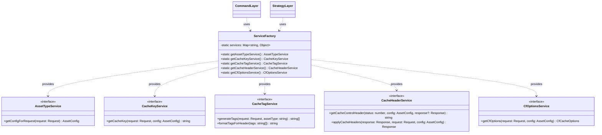

# Services

This document provides details on the service-oriented architecture of the caching system.

## Overview

The services in this project follow a service-oriented architecture pattern and provide the core functionality for the caching system.



## Service Architecture

- `interfaces.ts` - Service interfaces and contracts
- `service-factory.ts` - Factory for creating and accessing services
- Specialized service implementations for specific responsibilities

## Available Services

| Service | File | Description |
|---------|------|-------------|
| Asset Type Service | `asset-type-service.ts` | Detects content type from URL patterns |
| Cache Key Service | `cache-key-service.ts` | Generates cache keys with query handling |
| Cache Tag Service | `cache-tag-service.ts` | Creates hierarchical cache tags |
| Cache Header Service | `cache-header-service.ts` | Manages response headers with dynamic TTL calculation |
| CF Options Service | `cf-options-service.ts` | Generates Cloudflare-specific options |

## Service Factory Pattern

Services are accessed through the `ServiceFactory` to allow for easier testing and dependency injection:

```typescript
// Get an instance of the service
const assetTypeService = ServiceFactory.getAssetTypeService();

// Use the service
const config = assetTypeService.getConfigForRequest(request);
```

## Service Implementation

### Asset Type Service

The `AssetTypeService` detects content types from URL patterns:

```typescript
interface AssetTypeService {
  getConfigForRequest(request: Request): AssetTypeConfig;
}

export class AssetTypeServiceImpl implements AssetTypeService {
  private assetConfigs: AssetConfigMap;
  
  constructor(customConfigs?: AssetConfigMap) {
    this.assetConfigs = customConfigs || defaultAssetConfigs;
  }
  
  public getConfigForRequest(request: Request): AssetTypeConfig {
    const url = new URL(request.url);
    
    // Find matching asset type based on regex
    for (const [assetType, config] of Object.entries(this.assetConfigs)) {
      if (config.regex.test(url.pathname)) {
        return {
          assetType,
          ...config,
        };
      }
    }
    
    // Default config for unmatched assets
    return {
      assetType: 'default',
      // Default config properties...
    };
  }
}
```

### Cache Key Service

The `CacheKeyService` generates cache keys with query parameter handling:

```typescript
interface CacheKeyService {
  getCacheKey(request: Request, config: AssetConfig): string;
}

export class CacheKeyServiceImpl implements CacheKeyService {
  public getCacheKey(request: Request, config: AssetConfig): string {
    const url = new URL(request.url);
    let cacheKey = url.origin + url.pathname;
    
    // Handle query parameters
    if (config.useQueryInCacheKey && url.search) {
      // Process query parameters based on configuration
      cacheKey += this.processQueryParameters(url, config);
    }
    
    // Handle variants
    if (config.variants) {
      cacheKey += this.processVariants(request, config.variants);
    }
    
    return cacheKey;
  }
  
  // Helper methods for query parameter handling
  private processQueryParameters(url: URL, config: AssetConfig): string {
    // Implementation...
  }
  
  // Helper methods for variant handling
  private processVariants(request: Request, variants: VariantConfig): string {
    // Implementation...
  }
}
```

### Cache Tag Service

The `CacheTagService` generates hierarchical cache tags for efficient purging:

```typescript
interface CacheTagService {
  generateTags(request: Request, assetType: string): string[];
  formatTagsForHeader(tags: string[]): string;
}

export class CacheTagServiceImpl implements CacheTagService {
  private namespace: string;
  private maxTags: number;
  
  constructor(namespace: string = 'cf', maxTags: number = 10) {
    this.namespace = namespace;
    this.maxTags = maxTags;
  }
  
  public generateTags(request: Request, assetType: string): string[] {
    const url = new URL(request.url);
    const tags: string[] = [];
    
    // Add host tag
    tags.push(`${this.namespace}:host:${url.hostname}`);
    
    // Add asset type tag
    tags.push(`${this.namespace}:type:${assetType}`);
    
    // Add path components
    const pathParts = url.pathname.split('/').filter(Boolean);
    if (pathParts.length > 0) {
      // Add file extension tag if present
      const lastPart = pathParts[pathParts.length - 1];
      const extMatch = lastPart.match(/\.([^.]+)$/);
      if (extMatch) {
        tags.push(`${this.namespace}:ext:${extMatch[1].toLowerCase()}`);
      }
      
      // Add path tags
      let currentPath = '';
      for (const part of pathParts) {
        currentPath += `/${part}`;
        tags.push(`${this.namespace}:path:${currentPath}`);
      }
    }
    
    // Limit the number of tags
    return tags.slice(0, this.maxTags);
  }
  
  public formatTagsForHeader(tags: string[]): string {
    return tags.join(',');
  }
}
```

### Cache Header Service

The `CacheHeaderService` manages response headers for optimal caching. A key feature is dynamically adjusting browser cache TTLs based on content age in the Cloudflare edge cache:

```typescript
interface CacheHeaderService {
  getCacheControlHeader(status: number, config: AssetConfig, response?: Response): string;
  applyCacheHeaders(response: Response, request: Request, config: AssetConfig): Response;
}

export class CacheHeaderServiceImpl implements CacheHeaderService {
  public getCacheControlHeader(status: number, config: AssetConfig, response?: Response): string {
    if (!config.ttl) return '';

    // Map status code to appropriate TTL
    let ttl = 0;
    if (status >= 200 && status < 300) ttl = config.ttl.ok;
    else if (status >= 300 && status < 400) ttl = config.ttl.redirects;
    else if (status >= 400 && status < 500) ttl = config.ttl.clientError;
    else if (status >= 500 && status < 600) ttl = config.ttl.serverError;

    // If no TTL or response is available, use the standard logic
    if (ttl <= 0 || !response) {
      return ttl > 0 ? `public, max-age=${ttl}` : 'no-store';
    }

    // Extract Age header if present to determine remaining TTL
    const ageHeader = response.headers.get('Age');
    let age = 0;
    if (ageHeader) {
      const parsedAge = parseInt(ageHeader, 10);
      if (!isNaN(parsedAge) && parsedAge >= 0) {
        age = parsedAge;
      }
    }

    // Calculate remaining TTL for the browser cache
    const remainingTtl = Math.max(0, Math.floor(ttl - age));
    
    // Log the calculation for debugging
    logger.debug('Dynamic TTL calculation', {
      originalTtl: ttl,
      ageHeader,
      parsedAge: age,
      remainingTtl,
      status
    });
    
    // Return appropriate Cache-Control header
    return remainingTtl > 0 ? `public, max-age=${remainingTtl}` : 'no-store';
  }
  
  public applyCacheHeaders(response: Response, request: Request, config: AssetConfig): Response {
    // Create a new response to modify headers
    const newResponse = new Response(response.body, response);
    
    // Get dependencies through factory
    const cacheTagService = ServiceFactory.getCacheTagService();
    
    // Set Cache-Control header based on response status and Age header
    const cacheControl = this.getCacheControlHeader(response.status, config, response);
    if (cacheControl) {
      newResponse.headers.set('Cache-Control', cacheControl);
    }
    
    // Keep the Age header in the response to browsers
    // This allows browsers to see how long the resource has been in the edge cache
    
    // Set cache tags if configured
    const assetType = 'assetType' in config ? config.assetType : 'default';
    const cacheTags = cacheTagService.generateTags(request, assetType);
    if (cacheTags && cacheTags.length > 0) {
      const formattedTags = cacheTagService.formatTagsForHeader(cacheTags);
      if (formattedTags) {
        newResponse.headers.set('Cache-Tag', formattedTags);
      }
    }
    
    return newResponse;
  }
}
```

### CF Options Service

The `CfOptionsService` generates Cloudflare-specific caching options:

```typescript
interface CfOptionsService {
  getCfOptions(request: Request, config: AssetConfig): CfCacheOptions;
}

export class CfOptionsServiceImpl implements CfOptionsService {
  public getCfOptions(request: Request, config: AssetConfig): CfCacheOptions {
    const cacheKeyService = ServiceFactory.getCacheKeyService();
    const cacheTagService = ServiceFactory.getCacheTagService();
    
    const cacheKey = cacheKeyService.getCacheKey(request, config);
    const cacheTags = cacheTagService.generateTags(request, config.assetType);
    
    return {
      cacheKey,
      cacheTags: cacheTags.length > 0 ? cacheTags : undefined,
      cacheEverything: true,
      cacheTtlByStatus: {
        '200-299': config.ttl.ok,
        '301-302': config.ttl.redirects,
        '400-499': config.ttl.clientError,
        '500-599': config.ttl.serverError
      },
      // Other Cloudflare-specific options
    };
  }
}
```

## Service Interfaces

Each service implements an interface defined in `interfaces.ts`, which allows for:

- Mock implementations in tests
- Alternative implementations for different environments
- Clear contracts between services

## Adding New Services

To add a new service:

1. Define the service interface in `interfaces.ts`
2. Create a service implementation class
3. Add a getter method to `ServiceFactory`
4. Update the service initialization in the factory
5. Add the service export to `index.ts`