# Caching Strategies

This document provides details on the caching strategies implemented in the caching service.

## Strategy Architecture

The caching service follows the Strategy pattern, allowing different caching behaviors to be applied based on the type of content being served.

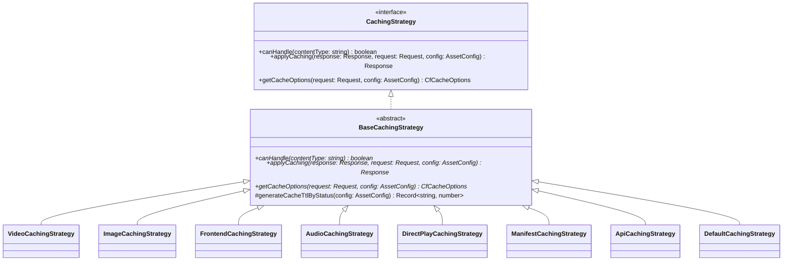

Each strategy implements:

1. **Content type detection** - Determining if the strategy can handle a given content type
2. **Cache header application** - Adding appropriate Cache-Control, Vary, and other headers
3. **Cache tag generation** - Adding cache tags for efficient purging
4. **Cloudflare option generation** - Setting Cloudflare-specific caching options

## Strategy Selection Process

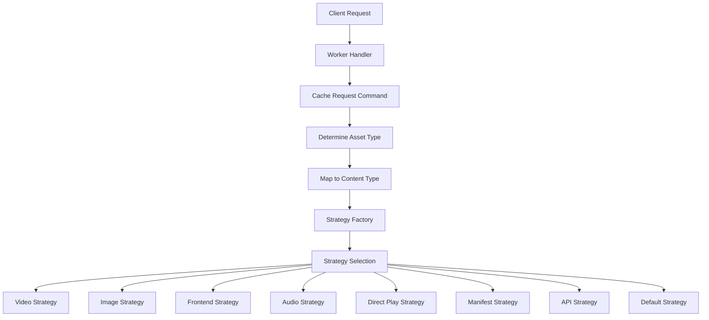

The strategy selection process:

1. The `CacheRequestCommand` determines the asset type from URL patterns
2. It maps the asset type to a specific content type
3. The `StrategyFactory` selects the appropriate strategy for that content type
4. If no strategy matches, the default strategy is used

## Available Strategies

### 1. Video Caching Strategy

Handles video content such as MP4, WebM, and other video formats.

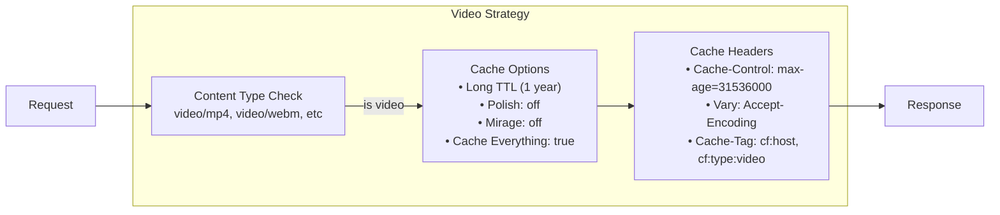

**Features:**
- Long-term caching (1 year)
- No query parameter caching (except for segments)
- Optimized for streaming content
- Video-specific cache tags

**Implementation:**

```typescript
export class VideoCachingStrategy extends BaseCachingStrategy {
  private supportedTypes = [
    'video/mp4', 'video/webm', 'video/ogg', 'video/quicktime'
  ];

  canHandle(contentType: string): boolean {
    return this.supportedTypes.some(type => 
      contentType === type || contentType.startsWith(`${type};`)
    );
  }

  applyCaching(response: Response, request: Request, config: AssetConfig): Response {
    // Implementation...
  }

  getCacheOptions(request: Request, config: AssetConfig): CfCacheOptions {
    // Implementation...
  }
}
```

### 2. Image Caching Strategy

Handles image content such as JPEG, PNG, WebP, and other image formats.

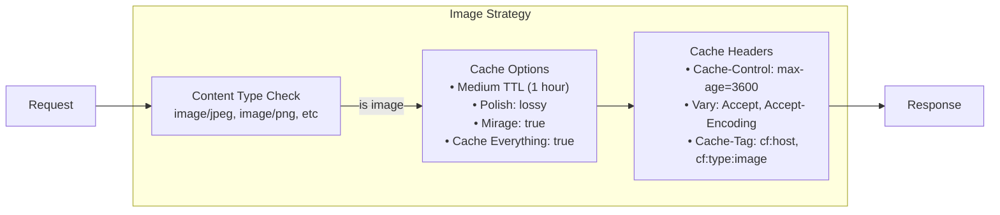

**Features:**
- Medium-term caching (1 hour)
- Query parameter handling for dimensions and format
- Image optimization options (Polish, Mirage)
- Client-hint respecting for responsive images
- Image-specific cache tags

### 3. Frontend Caching Strategy

Handles CSS and JavaScript files.

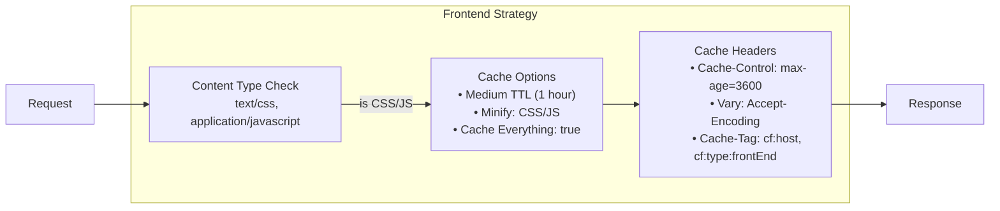

**Features:**
- Medium-term caching (1 hour)
- CSS and JS minification
- Version parameter handling
- Frontend-specific cache tags

### 4. Audio Caching Strategy

Handles audio files such as MP3, AAC, FLAC, and other audio formats.

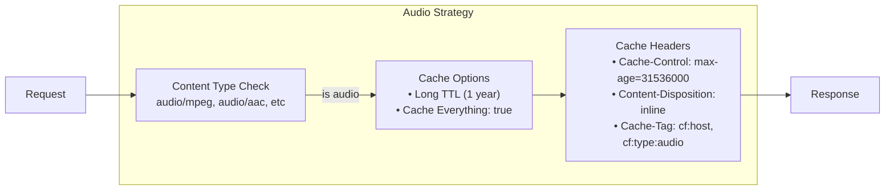

**Features:**
- Long-term caching (1 year)
- Content-Disposition for playback
- No query parameter caching
- Audio-specific cache tags

### 5. Direct Play Caching Strategy

Handles direct download/streaming files.

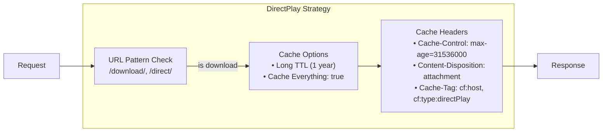

**Features:**
- Long-term caching (1 year)
- Attachment Content-Disposition for downloads
- No query parameter caching
- Download-specific cache tags

### 6. Manifest Caching Strategy

Handles HLS and DASH manifest files (m3u8, mpd).

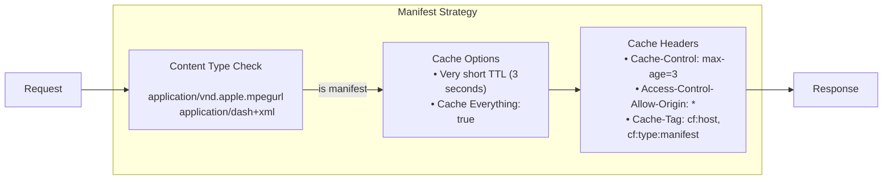

**Features:**
- Very short-term caching (3 seconds)
- Content-type correction for manifests
- CORS headers for cross-domain playback
- Query parameter handling for format and quality
- Manifest-specific cache tags

### 7. API Caching Strategy

Handles API responses like JSON and XML.

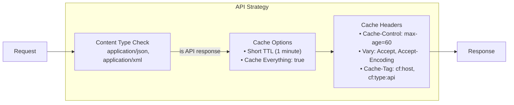

**Features:**
- Short-term caching (1 minute)
- Security headers for API responses
- Query parameter handling with exclusion of sensitive parameters
- Content negotiation via Vary headers
- API-specific cache tags

### 8. Default Caching Strategy

Fallback strategy for unrecognized content types.

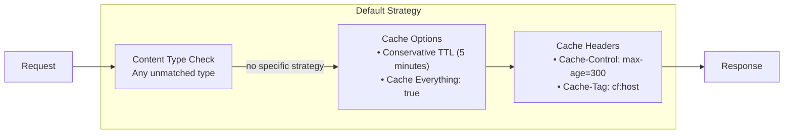

**Features:**
- Conservative caching (default to 5 minutes)
- Basic security headers
- Simple cache key generation

## Strategy Selection Algorithm

The strategy selection process is handled by the `StrategyFactory`:

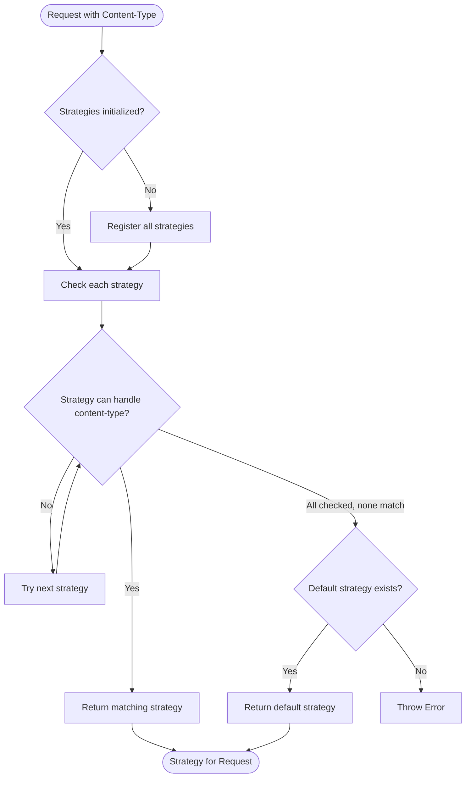

## Implementation Details

Each strategy extends the `BaseCachingStrategy` abstract class and implements:

```typescript
canHandle(contentType: string): boolean
applyCaching(response: Response, request: Request, config: AssetConfig): Response
getCacheOptions(request: Request, config: AssetConfig): CfCacheOptions
```

The strategy selection process:

1. The `CacheRequestCommand` determines the asset type from the request
2. It maps the asset type to a content type
3. The `StrategyFactory` selects the appropriate strategy based on content type
4. The strategy applies caching behavior to the response

## Base Strategy

The `BaseCachingStrategy` abstract class provides common functionality for all strategies:

```typescript
export abstract class BaseCachingStrategy implements CachingStrategy {
  abstract canHandle(contentType: string): boolean;
  abstract applyCaching(response: Response, request: Request, config: AssetConfig): Response;
  abstract getCacheOptions(request: Request, config: AssetConfig): CfCacheOptions;
  
  protected generateCacheTtlByStatus(config: AssetConfig): Record<string, number> {
    return {
      '200-299': config.ttl.ok, // OK responses
      '301-302': config.ttl.redirects, // Redirects
      '400-499': config.ttl.clientError, // Client errors
      '500-599': config.ttl.serverError, // Server errors
    };
  }
}
```

## Strategy Factory

The `StrategyFactory` selects the appropriate strategy based on content type:

```typescript
export class StrategyFactory {
  private static strategies: CachingStrategy[] = [];
  private static defaultStrategy: CachingStrategy | null = null;
  
  static initialize(): void {
    if (this.strategies.length > 0) {
      return; // Already initialized
    }
    
    // Register strategies
    this.registerStrategy(new VideoCachingStrategy());
    this.registerStrategy(new ImageCachingStrategy());
    this.registerStrategy(new FrontendCachingStrategy());
    this.registerStrategy(new AudioCachingStrategy());
    this.registerStrategy(new ManifestCachingStrategy());
    this.registerStrategy(new ApiCachingStrategy());
  }
  
  static registerStrategy(strategy: CachingStrategy): void {
    this.strategies.push(strategy);
  }
  
  static setDefaultStrategy(strategy: CachingStrategy): void {
    this.defaultStrategy = strategy;
  }
  
  static getStrategyForContentType(contentType: string): CachingStrategy {
    // Initialize if not done yet
    if (this.strategies.length === 0) {
      this.initialize();
    }
    
    // Find a strategy that can handle this content type
    for (const strategy of this.strategies) {
      if (strategy.canHandle(contentType)) {
        return strategy;
      }
    }
    
    // If no strategy is found, use default
    if (this.defaultStrategy) {
      return this.defaultStrategy;
    }
    
    throw new Error(`No strategy found for content type: ${contentType}`);
  }
}
```

## Integration Points

The caching strategies integrate with the following services:

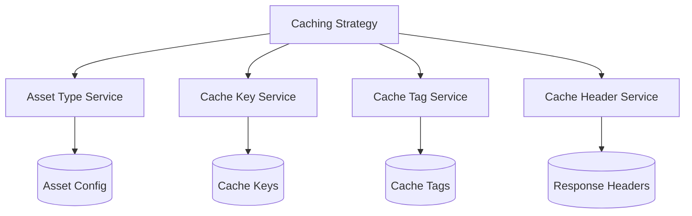

## Adding New Strategies

To add a new strategy:

1. Create a new class extending `BaseCachingStrategy`
2. Implement the required methods:
   - `canHandle(contentType: string): boolean`
   - `applyCaching(response: Response, request: Request, config: AssetConfig): Response`
   - `getCacheOptions(request: Request, config: AssetConfig): CfCacheOptions`
3. Register the strategy in `strategy-factory.ts`
4. Add the strategy export to `index.ts`
5. Update content type mapping in `cache-request-command.ts`

## Performance Considerations

Strategies are designed with performance in mind:

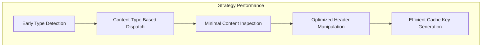

## Future Improvements

Potential improvements to the strategy system:

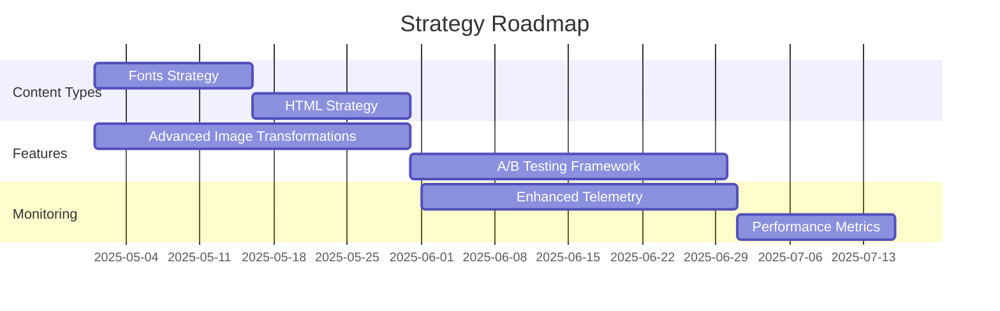

1. Fonts caching strategy
2. HTML caching strategy
3. Advanced image transformation options
4. A/B testing capabilities for caching strategies
5. Improved telemetry and monitoring
6. Support for more content types and file formats