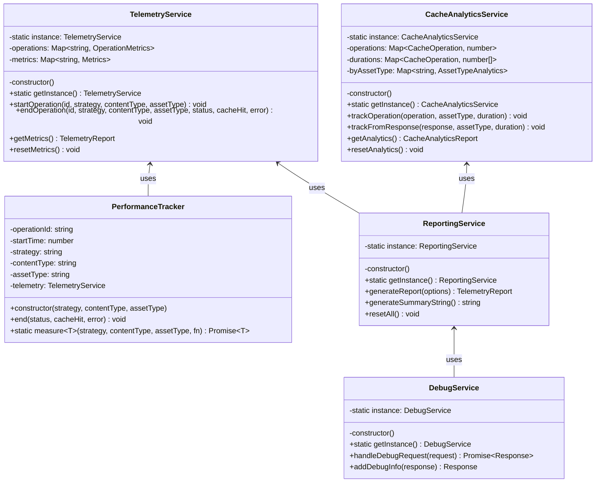
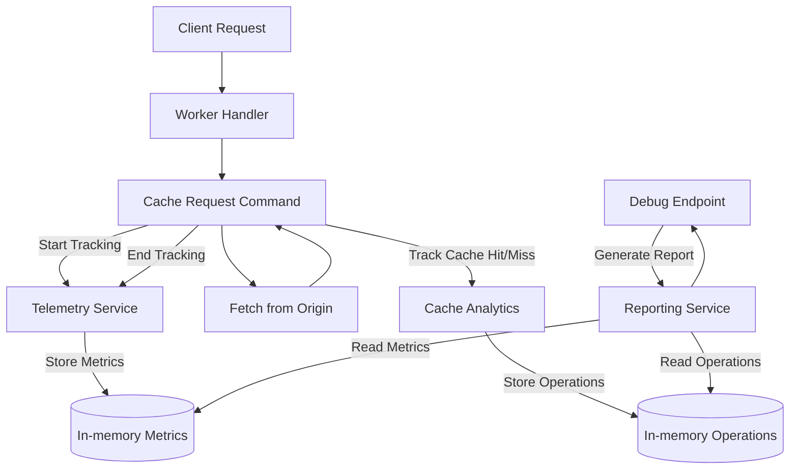

# Telemetry System

This document provides details on the telemetry system implemented in the caching service.

## Overview

The telemetry system provides detailed performance metrics, cache analytics, and reporting tools to understand how the caching service is performing in production. It's designed to have minimal performance impact while providing maximum insight.





## Components

The telemetry system consists of several components:

1. **TelemetryService** - Core service for tracking operation durations and metrics
2. **PerformanceTracker** - Utility for measuring specific operations
3. **CacheAnalyticsService** - Service for tracking cache hit/miss rates
4. **ReportingService** - Service for generating comprehensive reports
5. **DebugService** - Endpoint for viewing telemetry data

## Telemetry Service

The `TelemetryService` tracks operation performance:

```typescript
export class TelemetryService {
  private static instance: TelemetryService;
  private operations: Map<string, OperationMetrics>;
  private metrics: {
    byStrategy: Map<string, StrategyMetrics>;
    byContentType: Map<string, ContentTypeMetrics>;
    byAssetType: Map<string, AssetTypeMetrics>;
    totalRequests: number;
    totalDuration: number;
  };
  
  private constructor() {
    this.operations = new Map();
    this.metrics = {
      byStrategy: new Map(),
      byContentType: new Map(),
      byAssetType: new Map(),
      totalRequests: 0,
      totalDuration: 0
    };
  }
  
  public static getInstance(): TelemetryService {
    if (!TelemetryService.instance) {
      TelemetryService.instance = new TelemetryService();
    }
    return TelemetryService.instance;
  }
  
  public startOperation(
    id: string,
    strategy: string,
    contentType: string,
    assetType: string
  ): void {
    this.operations.set(id, {
      startTime: performance.now(),
      strategy,
      contentType,
      assetType
    });
  }
  
  public endOperation(
    id: string,
    strategy: string,
    contentType: string,
    assetType: string,
    status: number,
    cacheHit: boolean,
    error: boolean
  ): void {
    const operation = this.operations.get(id);
    if (!operation) {
      return; // Operation not found
    }
    
    const duration = performance.now() - operation.startTime;
    
    // Update metrics
    this.updateStrategyMetrics(strategy, duration, cacheHit, error);
    this.updateContentTypeMetrics(contentType, duration, cacheHit, error);
    this.updateAssetTypeMetrics(assetType, duration, cacheHit, error);
    
    // Update totals
    this.metrics.totalRequests++;
    this.metrics.totalDuration += duration;
    
    // Remove operation from tracking
    this.operations.delete(id);
  }
  
  // Updating metrics methods
  private updateStrategyMetrics(
    strategy: string,
    duration: number,
    cacheHit: boolean,
    error: boolean
  ): void {
    // Implementation...
  }
  
  // Get metrics methods
  public getMetrics(): TelemetryReport {
    // Implementation...
  }
  
  // Reset metrics
  public resetMetrics(): void {
    // Implementation...
  }
}
```

## Performance Tracker

The `PerformanceTracker` utility measures specific operations:

```typescript
export class PerformanceTracker {
  private operationId: string;
  private startTime: number;
  private strategy: string;
  private contentType: string;
  private assetType: string;
  private telemetry: TelemetryService;
  
  constructor(strategy: string, contentType: string, assetType: string) {
    this.operationId = randomUUID();
    this.startTime = performance.now();
    this.strategy = strategy;
    this.contentType = contentType;
    this.assetType = assetType;
    this.telemetry = TelemetryService.getInstance();
    
    // Register start with telemetry service
    this.telemetry.startOperation(
      this.operationId,
      this.strategy,
      this.contentType,
      this.assetType
    );
  }
  
  end(status: number, cacheHit: boolean = false, error: boolean = false): void {
    this.telemetry.endOperation(
      this.operationId,
      this.strategy,
      this.contentType,
      this.assetType,
      status,
      cacheHit,
      error
    );
  }
}
```

## Cache Analytics Service

The `CacheAnalyticsService` tracks cache hit/miss rates:

```typescript
export enum CacheOperation {
  HIT = 'HIT',
  MISS = 'MISS',
  BYPASS = 'BYPASS',
  EXPIRED = 'EXPIRED',
  ERROR = 'ERROR'
}

export class CacheAnalyticsService {
  private static instance: CacheAnalyticsService;
  private operations: Map<CacheOperation, number>;
  private durations: Map<CacheOperation, number[]>;
  private byAssetType: Map<string, AssetTypeAnalytics>;
  
  private constructor() {
    this.operations = new Map();
    this.durations = new Map();
    this.byAssetType = new Map();
    
    // Initialize maps
    Object.values(CacheOperation).forEach(op => {
      this.operations.set(op, 0);
      this.durations.set(op, []);
    });
  }
  
  public static getInstance(): CacheAnalyticsService {
    if (!CacheAnalyticsService.instance) {
      CacheAnalyticsService.instance = new CacheAnalyticsService();
    }
    return CacheAnalyticsService.instance;
  }
  
  public trackOperation(
    operation: CacheOperation,
    assetType: string,
    duration: number
  ): void {
    // Update total counts
    const count = this.operations.get(operation) || 0;
    this.operations.set(operation, count + 1);
    
    // Update durations
    const durations = this.durations.get(operation) || [];
    durations.push(duration);
    this.durations.set(operation, durations);
    
    // Update asset type metrics
    this.updateAssetTypeMetrics(assetType, operation, duration);
  }
  
  public trackFromResponse(
    response: Response,
    assetType: string,
    duration: number
  ): void {
    const cacheStatus = response.headers.get('CF-Cache-Status');
    let operation: CacheOperation;
    
    switch (cacheStatus) {
      case 'HIT':
        operation = CacheOperation.HIT;
        break;
      case 'MISS':
        operation = CacheOperation.MISS;
        break;
      case 'BYPASS':
        operation = CacheOperation.BYPASS;
        break;
      case 'EXPIRED':
        operation = CacheOperation.EXPIRED;
        break;
      default:
        operation = CacheOperation.ERROR;
    }
    
    this.trackOperation(operation, assetType, duration);
  }
  
  // Get analytics methods
  public getAnalytics(): CacheAnalyticsReport {
    // Implementation...
  }
  
  // Reset analytics
  public resetAnalytics(): void {
    // Implementation...
  }
}
```

## Reporting Service

The `ReportingService` generates comprehensive reports:

```typescript
export class ReportingService {
  private static instance: ReportingService;
  
  private constructor() {}
  
  public static getInstance(): ReportingService {
    if (!ReportingService.instance) {
      ReportingService.instance = new ReportingService();
    }
    return ReportingService.instance;
  }
  
  public generateReport(options: ReportOptions = {}): TelemetryReport {
    const telemetry = TelemetryService.getInstance();
    const cacheAnalytics = CacheAnalyticsService.getInstance();
    
    const report: TelemetryReport = {
      timestamp: new Date().toISOString()
    };
    
    // Add performance metrics if requested
    if (options.includePerformance) {
      report.performanceMetrics = telemetry.getMetrics();
    }
    
    // Add cache analytics if requested
    if (options.includeCacheAnalytics) {
      report.cacheAnalytics = cacheAnalytics.getAnalytics();
    }
    
    return report;
  }
  
  public generateSummaryString(): string {
    const report = this.generateReport({
      includePerformance: true,
      includeCacheAnalytics: true
    });
    
    // Format report as string
    let summary = `Telemetry Summary (${report.timestamp}):\n`;
    
    // Add performance metrics
    if (report.performanceMetrics) {
      summary += `Requests: ${report.performanceMetrics.totalRequests}\n`;
      summary += `Avg Duration: ${report.performanceMetrics.averageDuration.toFixed(2)}ms\n`;
      summary += `Cache Hit Rate: ${(report.performanceMetrics.cacheHitRate * 100).toFixed(2)}%\n`;
      summary += `Error Rate: ${(report.performanceMetrics.errorRate * 100).toFixed(2)}%\n`;
    }
    
    // Add cache analytics
    if (report.cacheAnalytics) {
      summary += `Cache Operations: ${report.cacheAnalytics.totalOperations}\n`;
      summary += `Hit Rate: ${(report.cacheAnalytics.hitRate * 100).toFixed(2)}%\n`;
      summary += `Miss Rate: ${(report.cacheAnalytics.missRate * 100).toFixed(2)}%\n`;
      summary += `Avg Hit Time: ${report.cacheAnalytics.averageHitTime.toFixed(2)}ms\n`;
      summary += `Avg Miss Time: ${report.cacheAnalytics.averageMissTime.toFixed(2)}ms\n`;
    }
    
    return summary;
  }
  
  public resetAll(): void {
    const telemetry = TelemetryService.getInstance();
    const cacheAnalytics = CacheAnalyticsService.getInstance();
    
    telemetry.resetMetrics();
    cacheAnalytics.resetAnalytics();
  }
}
```

## Debug Service

The `DebugService` provides a debug endpoint:

```typescript
export class DebugService {
  private static instance: DebugService;
  
  private constructor() {
    logger.debug('DebugService initialized');
  }
  
  public static getInstance(): DebugService {
    if (!DebugService.instance) {
      DebugService.instance = new DebugService();
    }
    return DebugService.instance;
  }
  
  async handleDebugRequest(request: Request): Promise<Response> {
    const url = new URL(request.url);
    
    // Check if this is a request to reset telemetry
    if (request.method === 'POST' && url.searchParams.has('reset')) {
      reporting.resetAll();
      return new Response(JSON.stringify({ status: 'ok', message: 'Telemetry reset' }), {
        headers: { 'Content-Type': 'application/json' }
      });
    }
    
    // Check if this is a request for the debug UI
    const acceptHeader = request.headers.get('Accept') || '';
    if (acceptHeader.includes('text/html')) {
      return new Response(DEBUG_HTML_TEMPLATE, {
        headers: { 'Content-Type': 'text/html' }
      });
    }
    
    // Default: return JSON telemetry data
    const report = reporting.generateReport({
      includePerformance: true,
      includeCacheAnalytics: true,
      detailedBreakdown: true
    });
    
    return new Response(JSON.stringify(report, null, 2), {
      headers: { 'Content-Type': 'application/json' }
    });
  }
  
  addDebugInfo(response: Response): Response {
    const headers = new Headers(response.headers);
    
    // Generate a summary report
    const report = reporting.generateReport({
      includePerformance: true,
      includeCacheAnalytics: true,
      detailedBreakdown: false
    });
    
    // Add basic debug headers
    headers.set('X-Cache-Debug-HitRate', (report.cacheAnalytics?.hitRate || 0).toString());
    headers.set('X-Cache-Debug-RequestCount', (report.performanceMetrics?.totalRequests || 0).toString());
    headers.set('X-Cache-Debug-AvgDuration', (report.performanceMetrics?.averageDuration || 0).toString());
    
    return new Response(response.body, {
      status: response.status,
      statusText: response.statusText,
      headers
    });
  }
}
```

## Integration Points

Telemetry is integrated at key points in the caching service:

1. **CacheRequestCommand** - Tracks overall request handling
2. **CachingStrategies** - Track strategy-specific performance
3. **ServiceFactory** - Provides access to telemetry services
4. **Main worker handler** - Exposes debug endpoint

## Metrics Collected

The telemetry system collects the following metrics:

### Performance Metrics

- Request count
- Average duration
- Minimum/maximum durations
- Error rate
- Request duration by strategy
- Request duration by content type
- Request duration by asset type

### Cache Analytics

- Cache hit/miss rates
- Cache operation counts (hit, miss, expired, bypass, error)
- Average hit/miss times
- Cache performance by asset type

## Performance Impact

The telemetry system is designed to have minimal impact on performance:

1. In-memory storage for fast access
2. No synchronous file or network operations
3. Lightweight data structures
4. No blocking operations

## Future Improvements

1. **Persistent Storage** - Add option to persist telemetry data between worker restarts
2. **Sampling** - Implement sampling for high-volume deployments
3. **Anomaly Detection** - Add automatic detection of performance anomalies
4. **Visualization** - Enhanced visualization in the debug UI
5. **Alert Integration** - Integration with external alerting systems