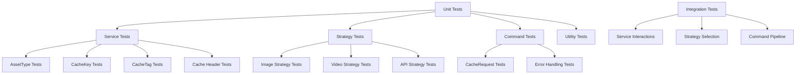
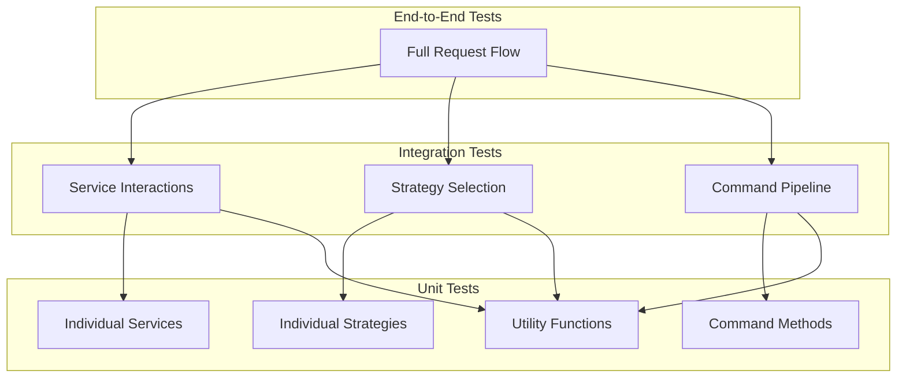

# Testing Guide

This document provides details on the testing approach for the caching service.

## Overview

The test suite follows these principles:
- Unit tests for individual components
- Integration tests for component interactions
- Mocking of external dependencies
- Comprehensive coverage of edge cases



## Test Hierarchy



## Test Structure

Tests are organized to mirror the source code structure:

```
tests/
  ├── services/            # Service tests
  │   ├── asset-type-service.test.ts
  │   ├── cache-header-service.test.ts
  │   └── ...
  ├── strategies/          # Strategy tests
  │   ├── default-caching-strategy.test.ts
  │   ├── image-caching-strategy.test.ts
  │   └── ...
  └── commands/            # Command tests
      └── cache-request-command.test.ts
```

## Running Tests

```bash
# Run all tests
npm test

# Run specific test
vitest -t "test name"

# Run tests in watch mode
vitest --watch

# Run tests with coverage
vitest --coverage
```

## Mocking

Tests use Vitest mocking capabilities:

```typescript
// Mock dependencies
vi.mock('../services/service-factory', () => ({
  ServiceFactory: {
    getSomeService: vi.fn(() => ({
      someMethod: vi.fn(() => 'mocked result')
    }))
  }
}));
```

## Test Pattern

Each test file follows this pattern:

```typescript
import { describe, it, expect, vi, beforeEach } from 'vitest';
import { ComponentToTest } from '../path/to/component';

describe('ComponentName', () => {
  let instance: ComponentToTest;
  
  beforeEach(() => {
    vi.clearAllMocks();
    instance = new ComponentToTest();
  });
  
  describe('methodName', () => {
    it('should do something specific', () => {
      // Setup
      const input = 'example';
      
      // Execute
      const result = instance.methodName(input);
      
      // Verify
      expect(result).toBe('expected output');
    });
  });
});
```

## Service Tests

Service tests focus on testing the individual service implementations:

```typescript
describe('CacheKeyService', () => {
  let service: CacheKeyService;
  
  beforeEach(() => {
    service = new CacheKeyServiceImpl();
  });
  
  describe('getCacheKey', () => {
    it('should generate basic cache key without query params', () => {
      // Setup
      const request = new Request('https://example.com/path');
      const config = {
        useQueryInCacheKey: false,
        // other config...
      };
      
      // Execute
      const result = service.getCacheKey(request, config);
      
      // Verify
      expect(result).toBe('https://example.com/path');
    });
    
    it('should include query params when configured', () => {
      // Setup
      const request = new Request('https://example.com/path?a=1&b=2');
      const config = {
        useQueryInCacheKey: true,
        // other config...
      };
      
      // Execute
      const result = service.getCacheKey(request, config);
      
      // Verify
      expect(result).toBe('https://example.com/path?a=1&b=2');
    });
  });
});
```

## Strategy Tests

Strategy tests focus on testing the individual strategy implementations:

```typescript
describe('ImageCachingStrategy', () => {
  let strategy: ImageCachingStrategy;
  
  beforeEach(() => {
    vi.clearAllMocks();
    strategy = new ImageCachingStrategy();
  });
  
  describe('canHandle', () => {
    it('should handle image content types', () => {
      expect(strategy.canHandle('image/jpeg')).toBe(true);
      expect(strategy.canHandle('image/png')).toBe(true);
      expect(strategy.canHandle('image/webp')).toBe(true);
    });
    
    it('should not handle non-image content types', () => {
      expect(strategy.canHandle('text/html')).toBe(false);
      expect(strategy.canHandle('application/json')).toBe(false);
    });
  });
  
  describe('applyCaching', () => {
    it('should apply cache headers to image files', () => {
      // Setup
      const request = new Request('https://example.com/image.jpg');
      const response = new Response(new ArrayBuffer(1024), {
        headers: { 'Content-Type': 'image/jpeg' }
      });
      const config = {
        ttl: { ok: 3600, redirects: 30, clientError: 10, serverError: 0 },
        useQueryInCacheKey: true,
        // other config...
      };
      
      // Execute
      const result = strategy.applyCaching(response, request, config);
      
      // Verify
      expect(result.headers.get('Cache-Control')).toBe('public, max-age=3600');
      expect(result.headers.get('Cache-Tag')).toContain('cf:type:image');
    });
  });
});
```

## Command Tests

Command tests focus on testing the command implementations:

```typescript
describe('CacheRequestCommand', () => {
  let command: CacheRequestCommand;
  
  beforeEach(() => {
    vi.clearAllMocks();
    
    // Setup mocks
    const mockConfig = { /* Mock config */ };
    const mockStrategy = { /* Mock strategy */ };
    
    vi.mocked(ServiceFactory.getAssetTypeService).mockReturnValue({
      getConfigForRequest: vi.fn(() => mockConfig)
    } as any);
    
    vi.mocked(StrategyFactory.getStrategyForContentType).mockReturnValue(mockStrategy as any);
    
    command = new CacheRequestCommand(new Request('https://example.com'));
  });
  
  describe('execute', () => {
    it('should execute the caching pipeline', async () => {
      // Execute
      const result = await command.execute();
      
      // Verify
      expect(ServiceFactory.getAssetTypeService).toHaveBeenCalled();
      expect(StrategyFactory.getStrategyForContentType).toHaveBeenCalled();
      // other assertions...
    });
    
    it('should handle errors properly', async () => {
      // Setup error condition
      vi.mocked(ServiceFactory.getAssetTypeService).mockImplementation(() => {
        throw new Error('Test error');
      });
      
      // Execute
      const result = await command.execute();
      
      // Verify error response
      expect(result.status).toBe(500);
      // other assertions...
    });
  });
});
```

## Integration Tests

Integration tests focus on testing the interactions between components:

```typescript
describe('Integration', () => {
  describe('CacheRequestCommand with real services', () => {
    it('should process a request through the entire pipeline', async () => {
      // Setup real services
      const assetTypeService = new AssetTypeServiceImpl();
      const cacheKeyService = new CacheKeyServiceImpl();
      const cacheTagService = new CacheTagServiceImpl();
      
      // Override the factory to use real services
      vi.mocked(ServiceFactory.getAssetTypeService).mockReturnValue(assetTypeService);
      vi.mocked(ServiceFactory.getCacheKeyService).mockReturnValue(cacheKeyService);
      vi.mocked(ServiceFactory.getCacheTagService).mockReturnValue(cacheTagService);
      
      // Mock the fetch operation
      global.fetch = vi.fn().mockResolvedValue(new Response('test content'));
      
      // Execute
      const command = new CacheRequestCommand(new Request('https://example.com/image.jpg'));
      const result = await command.execute();
      
      // Verify
      expect(result.status).toBe(200);
      expect(result.headers.get('Cache-Control')).toBeDefined();
    });
  });
});
```

## Test Coverage Goals

- **Services**: 95%+ coverage
- **Strategies**: 90%+ coverage
- **Commands**: 90%+ coverage
- **Utils**: 85%+ coverage

## Current Test Coverage

Current test coverage is excellent for all services:
- CacheTagService: Excellent coverage (21 tests)
- CacheKeyService: Excellent coverage (21 tests)
- AssetTypeService: Good coverage (5 tests)
- CfOptionsService: Good coverage (4 tests)
- CacheHeaderService: Excellent coverage (18 tests)
- ServiceFactory: Good coverage (5 tests)
- Integration: Good coverage (7 tests)
- Full Request Flow: Basic coverage (3 tests)

## Test Improvements

Areas for further improvement in testing:

1. **End-to-End Tests**: Add full end-to-end tests that validate the entire caching pipeline from request to response in a real environment.

2. **Performance Tests**: Add tests for performance characteristics, especially for the cache tag generation which could be expensive for deep paths.

3. **Edge Cases**: Add more edge case tests, especially for:
   - Malformed URLs
   - Invalid configurations
   - Extremely large paths or query parameters
   - Special Cloudflare behaviors

4. **Increased Mocking Precision**: Improve the mocks to better simulate the real service behaviors.

5. **Parameterized Tests**: Add parameterized tests for testing multiple input combinations with the same test logic.

## Adding New Tests

When adding tests:
1. Create a test file matching the component name (e.g., `component-name.test.ts`)
2. Follow the established test pattern
3. Mock external dependencies
4. Test both success cases and error handling
5. Include edge cases and typical usage patterns