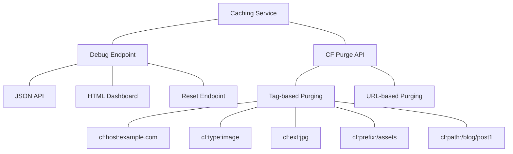
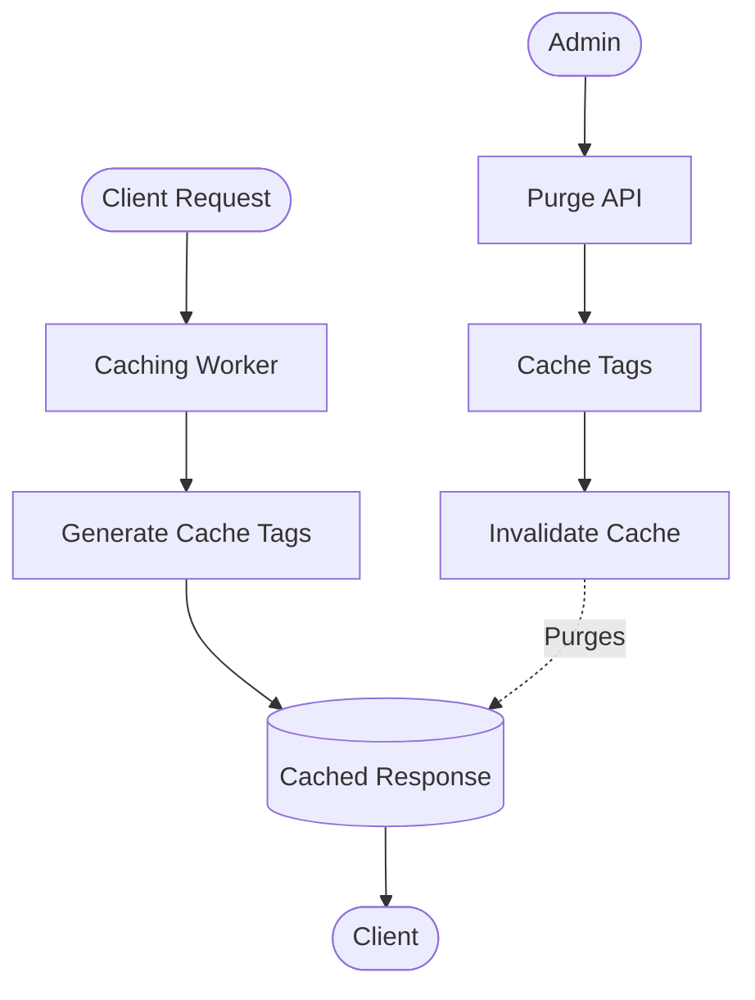
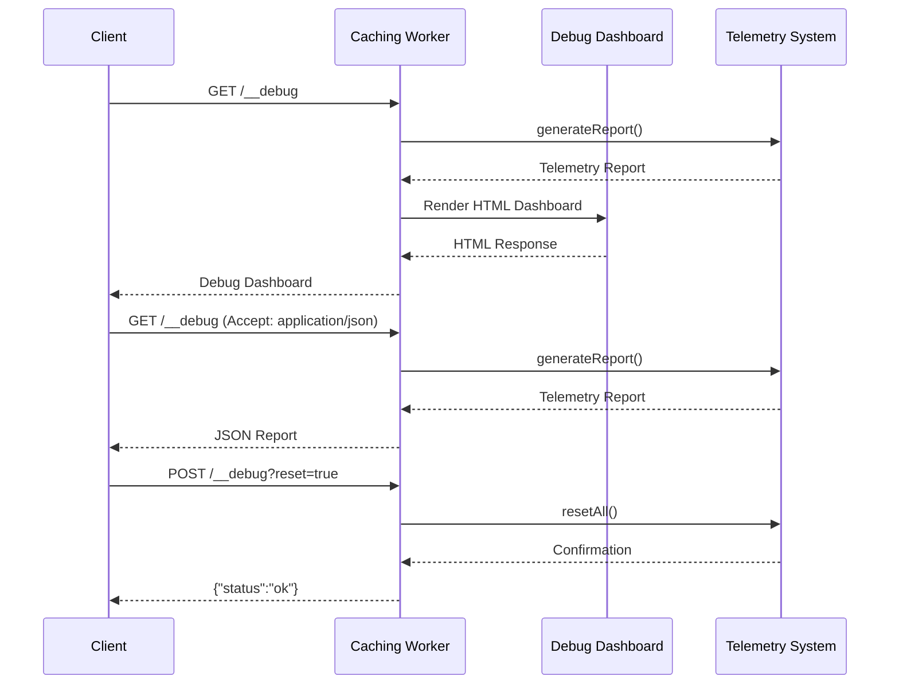

# API Reference

This document describes the API endpoints provided by the Cloudflare Caching Service.



## Cache Tag Purging

The caching service supports Cloudflare's cache tag purging feature for granular cache invalidation. The hierarchical tag structure allows for targeted purging at different levels of granularity.



### Common Tag Patterns

| Tag Pattern | Example | Use Case |
|-------------|---------|----------|
| `cf:host:{hostname}` | `cf:host:example.com` | Purge all content for a specific host |
| `cf:type:{asset_type}` | `cf:type:image` | Purge all assets of a specific type |
| `cf:ext:{extension}` | `cf:ext:jpg` | Purge all files with a specific extension |
| `cf:prefix:{path}` | `cf:prefix:/blog` | Purge all content under a path prefix |
| `cf:path:{full_path}` | `cf:path:/blog/post1.html` | Purge a specific path |

### Purge API

To purge content by cache tag, use the Cloudflare API:

```bash
curl -X POST "https://api.cloudflare.com/client/v4/zones/{zone_id}/purge_cache" \
  -H "Authorization: Bearer {api_token}" \
  -H "Content-Type: application/json" \
  --data '{"tags":["cf:host:example.com","cf:type:image"]}'
```

## Debug Endpoint



The telemetry data is exposed via a debug endpoint at `/__debug`. This endpoint provides:

1. **HTML Dashboard** - Visual overview of telemetry data
2. **JSON API** - Raw telemetry data for integration with monitoring tools
3. **Reset Capability** - Ability to reset telemetry data

### Using the Debug Endpoint

Access the debug endpoint at:
```
https://your-domain.com/__debug
```

The endpoint responds differently based on the `Accept` header:
- `Accept: text/html` - Returns HTML dashboard
- `Accept: application/json` - Returns JSON data

Reset telemetry data by sending a POST request:
```
POST https://your-domain.com/__debug?reset=true
```

### Example Debug Response

```json
{
  "timestamp": "2023-01-01T12:00:00Z",
  "performanceMetrics": {
    "totalRequests": 1000,
    "averageDuration": 50.2,
    "cacheHitRate": 0.85,
    "errorRate": 0.01,
    "byStrategy": {
      "ImageCachingStrategy": {
        "totalDuration": 25000,
        "count": 500,
        "min": 10,
        "max": 200,
        "cacheHits": 450,
        "cacheMisses": 50,
        "errors": 0
      }
    }
  },
  "cacheAnalytics": {
    "totalOperations": 1000,
    "hitRate": 0.85,
    "missRate": 0.15,
    "errorRate": 0.01,
    "hits": 850,
    "misses": 150,
    "expired": 0,
    "bypass": 0,
    "errors": 10,
    "averageHitTime": 25.5,
    "averageMissTime": 80.2
  }
}
```

## Error Responses

When an error occurs, the service returns a structured error response:

```json
{
  "error": {
    "type": "CacheError",
    "message": "Failed to process request",
    "details": {
      "url": "https://example.com/image.jpg",
      "status": 500
    }
  }
}
```

Common error types:

| Error Type | Description |
|------------|-------------|
| `CacheError` | General caching error |
| `FetchError` | Error fetching from origin |
| `ServiceError` | Error in a service component |