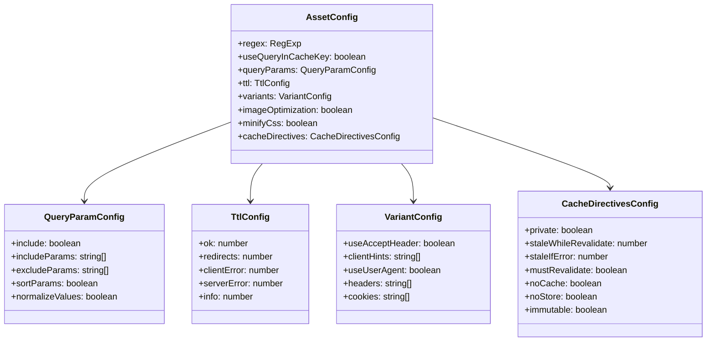
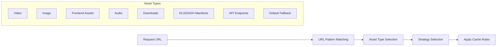

# Configuration Guide

This guide covers the configuration options for the Cloudflare Caching Service.

## Environment Configuration

Configuration is handled through environment variables in `wrangler.jsonc`:

| Variable | Description | Default |
|----------|-------------|---------|
| `ENVIRONMENT` | Environment name (development, staging, production) | `development` |
| `LOG_LEVEL` | Logging level (DEBUG, INFO, WARN, ERROR) | `INFO` |
| `DEBUG_MODE` | Enable/disable debug mode | `false` |
| `MAX_CACHE_TAGS` | Maximum number of cache tags per request | `10` |
| `CACHE_TAG_NAMESPACE` | Namespace prefix for cache tags | `cf` |

Example configuration in `wrangler.jsonc`:

```json
{
  "name": "caching",
  "vars": {
    "ENVIRONMENT": "production",
    "LOG_LEVEL": "INFO",
    "DEBUG_MODE": "false",
    "MAX_CACHE_TAGS": "20",
    "CACHE_TAG_NAMESPACE": "cf"
  }
}
```

## Asset Type Configuration



Asset types are defined in `asset-type-service.ts` and determine how different content types are cached. Each asset type has the following configuration options:

| Option | Description | Example |
|--------|-------------|---------|
| `regex` | Pattern to match URL paths | `/(.*\/Video)\|(.*\.(mp4\|webm))$/` |
| `useQueryInCacheKey` | Whether to include query parameters in cache keys | `true` or `false` |
| `queryParams` | Options for query parameter handling | See below |
| `ttl` | Cache time-to-live settings for different status codes | See below |
| `variants` | Configuration for content variants | See below |

### Query Parameter Configuration

The `queryParams` object supports the following options:

```javascript
{
  include: true, // Whether to include query parameters in cache keys
  includeParams: ['width', 'height', 'format'], // Specific parameters to include
  excludeParams: ['token', 'auth'], // Specific parameters to exclude
  sortParams: true, // Whether to sort parameters for cache key consistency
  normalizeValues: true // Whether to normalize parameter values
}
```

### TTL Configuration

The `ttl` object sets cache time-to-live durations for different status code ranges:

```javascript
{
  ok: 3600, // Seconds to cache 200-299 responses
  redirects: 30, // Seconds to cache 301-302 responses
  clientError: 10, // Seconds to cache 400-499 responses
  serverError: 0 // Seconds to cache 500-599 responses
}
```

### Variants Configuration

The `variants` object configures content variations for responsive delivery:

```javascript
{
  useAcceptHeader: true, // Vary responses based on Accept header
  clientHints: ['DPR', 'Width'], // Use client hints for responsive images
  useUserAgent: true, // Vary responses based on User-Agent
  headers: ['Accept-Language'], // Additional headers to vary on
  cookies: ['preferredLanguage'] // Cookies to vary on
}
```

## Default Asset Configurations



The service includes pre-configured asset types for common content:

| Asset Type | URL Pattern | Cache TTL | Key Features |
|------------|-------------|-----------|--------------|
| `video` | `/(.*\/Video)\|(.*\.(mp4\|webm))$/` | 1 year | Long-term caching, no query params |
| `image` | `/(.*\/Images)\|(.*\.(jpg\|png))$/` | 1 hour | Image optimization, polish, mirage |
| `frontEnd` | `/^.*\.(css\|js)$/` | 1 hour | CSS/JS minification, version params |
| `audio` | `/(.*\/Audio)\|(.*\.(mp3\|aac))$/` | 1 year | Audio content-type handling |
| `directPlay` | `/.*(\/Download)/` | 1 year | Content-Disposition: attachment |
| `manifest` | `/^.*\.(m3u8\|mpd)$/` | 3 seconds | CORS headers, frequent updates |
| `api` | `/^.*\/api\/.*/` | 1 minute | Query param handling, JSON optimization |

### TTL Visualization by Asset Type

```mermaid
xychart-beta
    title "Cache TTL by Asset Type (seconds)"
    x-axis [Video, Image, Frontend, Audio, DirectPlay, Manifest, API]
    y-axis "Seconds (log scale)" 10 -> 31536000
    bar [31536000, 3600, 3600, 31536000, 31536000, 3, 60]
```

## Adding Custom Asset Types

You can add custom asset types by modifying the `defaultAssetConfigs` object in `asset-type-service.ts`:

```typescript
export const defaultAssetConfigs: AssetConfigMap = {
  // Existing asset types...
  
  // Add custom asset type
  customType: {
    regex: /^.*\/custom\/.*$/,
    useQueryInCacheKey: true,
    queryParams: {
      include: true,
      excludeParams: ['token'],
      sortParams: true
    },
    ttl: {
      ok: 3600,
      redirects: 30,
      clientError: 10,
      serverError: 0
    }
  }
};
```

## Cache Tag Configuration

The service generates cache tags automatically based on the request. The format follows this pattern:

```
{namespace}:{type}:{value}
```

For example: `cf:host:example.com` or `cf:path:/blog/post1.html`.

You can configure the namespace prefix using the `CACHE_TAG_NAMESPACE` environment variable.