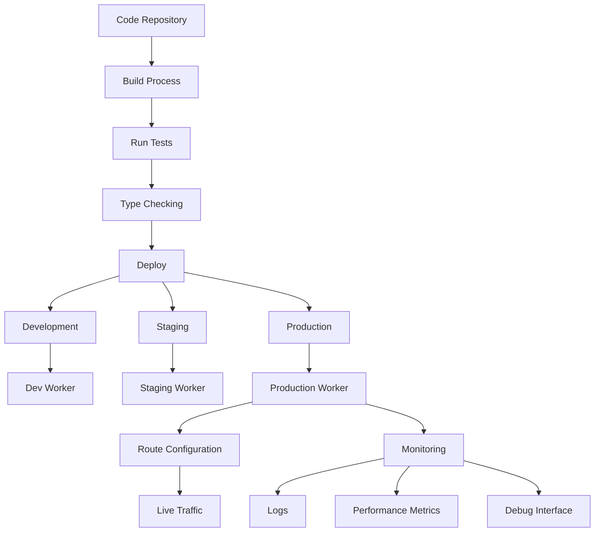
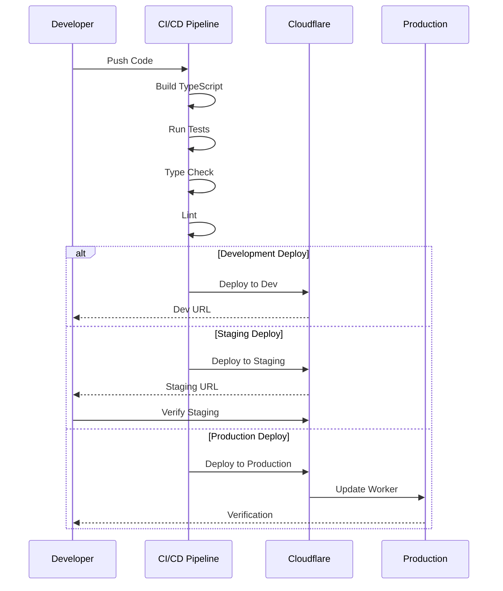
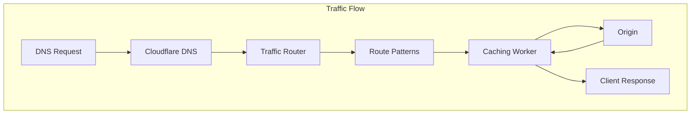
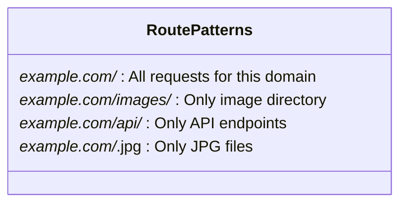

# Deployment Guide

This guide covers the deployment process for the Cloudflare Caching Service.



## Deployment Workflow



## Prerequisites

- Node.js 16+
- npm 8+
- Cloudflare account with Workers enabled
- Wrangler CLI installed and authenticated

## Environment Setup

The caching service supports multiple deployment environments defined in `wrangler.jsonc`:

```json
{
  "env": {
    "staging": {
      "name": "staging-caching",
      "vars": {
        "ENVIRONMENT": "staging",
        "DEBUG_MODE": "true",
        "MAX_CACHE_TAGS": "20",
        "CACHE_TAG_NAMESPACE": "cf"
      },
      "workers_dev": true
    },
    "production": {
      "name": "prod-caching",
      "vars": {
        "ENVIRONMENT": "production",
        "LOG_LEVEL": "INFO",
        "DEBUG_MODE": "false",
        "MAX_CACHE_TAGS": "20",
        "CACHE_TAG_NAMESPACE": "cf"
      },
      "routes": [
        {
          "pattern": "*example.com/*",
          "zone_id": "your-zone-id"
        }
      ]
    }
  }
}
```

## Deployment Commands

The following npm scripts are available for deployment:

```bash
# Deploy to staging
npm run deploy:staging

# Deploy to production
npm run deploy:prod

# Deploy to development
npm run deploy:dev
```

These scripts are defined in `package.json` and use Wrangler to deploy to the appropriate environment.

## Deployment Process

1. Build the project:

```bash
npm run build
```

2. Deploy to the desired environment:

```bash
npm run deploy:prod
```

3. Verify the deployment:

```bash
wrangler tail prod-caching
```

## Route Configuration



To use the caching worker with a Cloudflare zone, configure routes in `wrangler.jsonc`:

```json
"routes": [
  {
    "pattern": "*example.com/*",
    "zone_id": "your-zone-id"
  }
]
```

You can find your zone ID in the Cloudflare dashboard under your domain's overview page.

### Route Pattern Examples



## Custom Domains

To use a custom domain with your worker:

1. Add the domain to your Cloudflare account
2. Configure DNS to point to Cloudflare
3. Add the route pattern to your worker configuration

## Monitoring Deployments

After deployment, monitor your worker using:

1. **Wrangler Tail**:
   ```bash
   wrangler tail prod-caching
   ```

2. **Cloudflare Dashboard**:
   - Navigate to Workers > Overview > Your Worker
   - View metrics for invocations, CPU time, and errors

3. **Debug Endpoint**:
   - Access the debug endpoint at `https://your-domain.com/__debug`
   - View detailed performance metrics and cache analytics

## Rollback Procedure

If you need to roll back to a previous version:

1. List your deployed versions:
   ```bash
   wrangler versions list
   ```

2. Rollback to a specific version:
   ```bash
   wrangler versions rollback --version=<version-id>
   ```

## Production Checklist

Before deploying to production, ensure:

1. ✅ All tests are passing: `npm test`
2. ✅ TypeScript compilation succeeds: `npm run typecheck`
3. ✅ No ESLint warnings: `npm run lint`
4. ✅ Debug mode is disabled in production settings
5. ✅ Proper logging level is set (INFO recommended for production)
6. ✅ Routes are correctly configured for your domain
7. ✅ Environment variables are properly set for production