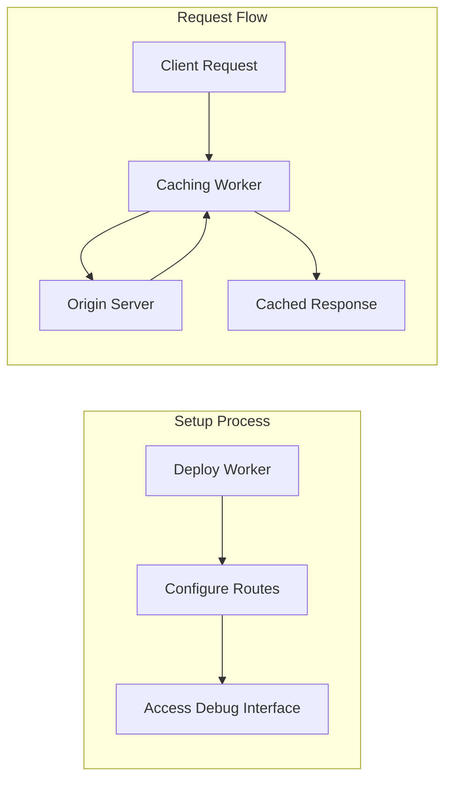
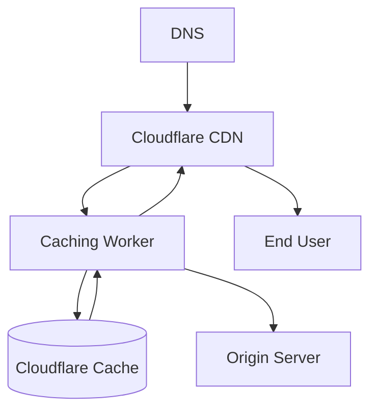

# Getting Started with Cloudflare Caching Service

This guide will help you install, configure, and start using the Cloudflare Caching Service.

## Prerequisites

- Node.js 16+
- npm 8+
- Cloudflare account with Workers enabled

## Installation

1. Clone the repository:

```bash
git clone https://github.com/your-organization/caching-service.git
cd caching-service
```

2. Install dependencies:

```bash
npm install
```

## Development

To start the development server:

```bash
npm run dev
```

This will start a local development server using Wrangler on port 9001.

## Testing

Run the test suite:

```bash
# Run all tests
npm test

# Run specific test
vitest -t "test name"

# Run tests in watch mode
npm run test:watch
```

## Configuration

The caching service can be configured through environment variables in `wrangler.jsonc`. For detailed configuration options, see the [Configuration Guide](./configuration.md).

## Basic Usage



1. Deploy the worker:

```bash
npm run deploy
```

2. Configure your Cloudflare zone to route traffic through the worker:



3. Access the debug endpoint to monitor performance:

```
https://your-domain.com/__debug
```

## Key Features

- Asset-specific caching rules based on file patterns
- Content-specific optimization strategies
- Cache tag support for efficient invalidation
- Comprehensive error handling and logging
- Telemetry and performance monitoring
- Real-time debug dashboard
- Strong TypeScript typing with ESM modules

## Next Steps

- [Configuration Guide](./configuration.md) - Learn about all available configuration options
- [API Reference](./api-reference.md) - Explore the API endpoints
- [Deployment Guide](./deployment.md) - Deploy to production environments